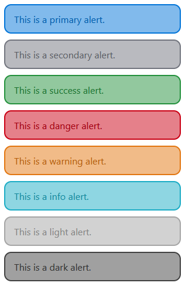

# Alerts

Alerts are ways to give feedback messages to the user.

## Example

Alerts are availible in a range of colors, and are used by selecting the color you want and using the class `.alert-{color}`. The colors, background colors, and borders are already taken care of.



```
	<div class="alert alert-primary">
		This is a primary alert.
	</div>
	<div class="alert alert-secondary">
		This is a secondary alert.
	</div>
	<div class="alert alert-success">
		This is a success alert.
	</div>
	<div class="alert alert-danger">
		This is a danger alert.
	</div>
	<div class="alert alert-warning">
		This is a warning alert.
	</div>
	<div class="alert alert-info">
		This is a info alert.
	</div>
	<div class="alert alert-light">
		This is a light alert.
	</div>
	<div class="alert alert-dark">
		This is a dark alert.
	</div>
```

Fading alerts also exist, which can be accessed by using the class `.alert-{color}-fade`, which will make the alert fade after **5** seconds.

```
	<div class="alert alert-primary-fade">
		This is a fading primary alert.
	</div>
```