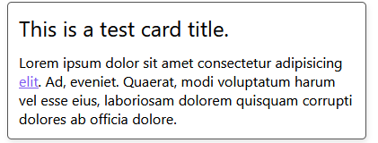

# Cards

Cards are small boxes with titles and content areas.

## Example

Cards can be accessed using the class `.card`, titles can be created using `.card-title`, and content can be created using `.card-content`.



```
	<div class="card">
		<div class="card-title">
			This is a test card title.
		</div>
		<p class="card-content">
			Lorem ipsum dolor sit amet consectetur adipisicing <a href="#">elit</a>. Ad, eveniet. Quaerat, modi voluptatum harum vel esse eius, laboriosam dolorem quisquam corrupti dolores ab officia dolore.
		</p>
	</div>
```
