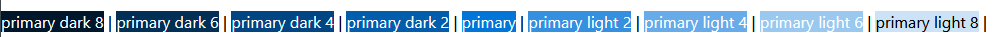

# Backgrounds

Self-explanitory.

## Example

Backgrounds are accessed by the class `.bg-{color}`.


```
	<span class="bg-primary text-white">primary bg</span> |
	<span class="bg-secondary text-white">secondary bg</span> |
	<span class="bg-blue text-white">blue bg</span> |
	<span class="bg-red text-white">red bg</span> |
	<span class="bg-yellow text-white">yellow bg</span> |
	<span class="bg-green text-white">green bg</span> |
	<span class="bg-orange text-white">orange bg</span> |
	<span class="bg-purple text-white">purple bg</span> |
	<span class="bg-gray text-white">gray bg</span> |
	<span class="bg-danger text-white">danger bg</span> |
	<span class="bg-info text-white">info bg</span> |
```

## Variants Example



```
	<span class="bg-primary-dark-8 text-white">primary dark 8</span> |
	<span class="bg-primary-dark-6 text-white">primary dark 6</span> |
	<span class="bg-primary-dark-4 text-white">primary dark 4</span> |
	<span class="bg-primary-dark-2 text-white">primary dark 2</span> |
	<span class="bg-primary text-white">primary</span> |
	<span class="bg-primary-light-2 text-white">primary light 2</span> |
	<span class="bg-primary-light-4 text-white">primary light 4</span> |
	<span class="bg-primary-light-6 text-white">primary light 6</span> |
	<span class="bg-primary-light-8 text-black">primary light 8</span> |
```
